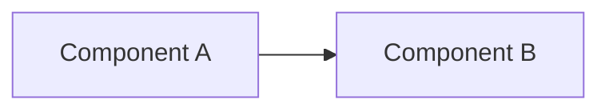

# Architecture Document テンプレート

`.aigile/docs/L3_architectures/<slug>.md` として配置される Architecture Document の標準フォーマット。aigile の開発フロー（`docs/workflow.md`）における **Architecture Document 作成・更新** の成果物テンプレート。

本ファイル自身（`TEMPLATE.md`）は **テンプレート定義**であり、Architecture Document として扱ってはならない（ワークフローは `TEMPLATE.md` を Document スキャン対象から除外する）。

## 配置とファイル名

- パス: `.aigile/docs/L3_architectures/<slug>.md`
- `<slug>` は基本的に対応する Specification Document のスラッグと一致させる。
  - 例: `.aigile/docs/L2_specifications/sso-login.md` を実現する Arch → `.aigile/docs/L3_architectures/sso-login.md`
- 横断的なアーキテクチャ（複数 Spec をまたぐ基盤）は領域名のスラッグを用いる。
  - 例: `auth-foundation.md`（複数 Spec の `depends_on` で参照される）
- 既存 Document が同一トピックを扱う場合は **新規作成ではなく追記/更新** を選択する（重複 Document を生まない）。

## テンプレート

````markdown
---
node_id: "arch:<slug>"
layer: architecture
last_updated: <YYYY-MM-DD>
depends_on:
  - id: "spec:<specification-slug>"
    relation: realizes
---

# Architecture: <タイトル>

## 概要

<この Architecture が実現する Spec と、採用した構造の要点を 1〜2 行で>

## 構造

<コンポーネント / モジュール / レイヤー構成。可能なら Mermaid 図を併記する。>



## 主要なデータ / 契約

- データモデル: <主要エンティティとリレーション>
- 公開契約: <API / イベント / コマンド の入出力スキーマ>
- 永続化: <DB / ストレージ / キャッシュ の選定>

## 技術選定

| 領域 | 採用 | 理由 |
|---|---|---|
| <領域> | <技術 / ライブラリ> | <選定理由> |

## 制約・非機能要件への対処

- 性能: <設計上の対処>
- 可用性: <冗長化 / 障害分離>
- セキュリティ: <認証・認可・暗号化の構造>

## 段階的構築（必要時）

<Spec のうちどの部分を先に / 後に実装するかの順序、移行戦略 など>

## スコープ外

- <他 Architecture Document が担う領域 / 将来検討>

## 関連

- 上位 Specification: `<specification-slug>` (`.aigile/docs/L2_specifications/<specification-slug>.md`)
- 関連 Architecture: <他 arch があれば>
- 参照 ADR / Design Note: <あれば>
````

## 記述ルール

- frontmatter は AI が生成・維持する正本（`docs/document-model.md`）。
- `node_id` の slug 部分は **ファイル名と一致** していなければならない（例: `arch:sso-login` ⇔ `sso-login.md`）。
- `depends_on[].id` は **実在する Specification Document** の `node_id` を指す。横断的制約として Requirement を直接参照する場合のみ `relation: constrained_by` を使用する（通常は不要）。
- `last_updated` は bash `date +%Y-%m-%d` で取得した本日の日付を YYYY-MM-DD 形式で記載する。
- **「どう作るか」の構造判断** を書く。Spec で既出の振る舞いを再記述しない。
- 既存 Document を更新する場合は、`last_updated` を本日の日付に置き換え、変更箇所を PR 本文の「変更内容」で説明する。

## PR 化のメタデータ

Architecture Document を作成・更新する後段ワークフローは、以下のメタデータで PR を発行する想定:

- **タイトル**: `[Architecture] <タイトル>`
- **ラベル**: `aigile:pr:arch`, `automation`
- **ベースブランチ**: `main`
- **本文テンプレート**:

```markdown
## 概要

Specification `spec:<specification-slug>` を受けて、Architecture Document を作成 / 更新した。

## 変更内容

- `.aigile/docs/L3_architectures/<slug>.md` を新規作成 / 更新
- <更新の場合は、変更した構造・技術選定・契約など、差分の要点を 3〜5 件箇条書きで>

## レビューポイント

- 上位 Specification の振る舞いを実現する構造として整合しているかを確認してください。
- 技術選定の理由が「なぜ他案ではなくこれか」の観点で読めるかを確認してください。
- 既存 Architecture との重複・矛盾、横断的非機能要件への対処の妥当性を確認してください。

## 関連

- 上位 Specification: `.aigile/docs/L2_specifications/<specification-slug>.md`
```
