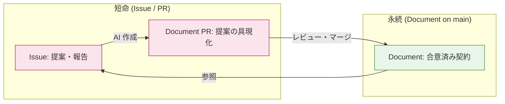
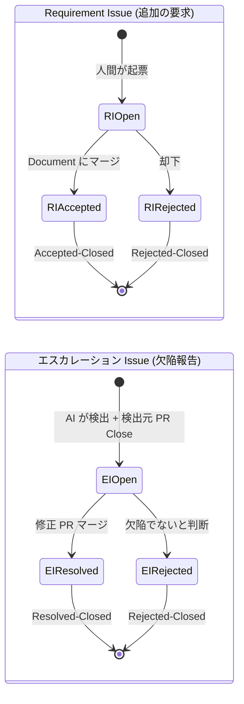
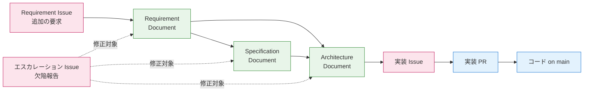

# コアコンセプト

aigile の設計判断を支える、最も根本的な概念モデルを定義します。

## Document = Source of Truth (SoT)

aigile では、プロジェクトの "満たすべき要求" は **Document** に集約されます。Document は main ブランチにマージされた状態が唯一の真実であり、他のすべての成果物（Issue, PR, コード）は Document を起点に解釈されます。

## Issue と Document の役割の分離

両者は同じ Markdown でも、ライフサイクルと意味論が根本的に異なります。

| 観点 | Issue | Document |
|---|---|---|
| 意味 | "追加の要求" または "報告" | "満たすべき要求" / "受け入れ済みの設計" |
| ライフサイクル | 短命（Closed で役目を終える） | 永続（main ブランチに残る） |
| 状態の終端 | Accepted-Closed / Rejected-Closed | マージ (=合意) / 改訂 |
| 認可主体 | 起票者は誰でも可 | レイヤーごとの承認者（[stakeholders.md](stakeholders.md) 参照） |

Issue は Git における Pull Request、Document は main ブランチの状態に類比できます。Issue は提案であり、Document は契約です。

## Issue の 2 種類

Issue は性質によって 2 種に分かれます。両者は最終的に Document の修正 PR を生み得ますが、**動機が異なる** ため意味論を分けます。

### Requirement Issue（追加の要求）

外部から持ち込まれる "新しく欲しいもの" を扱います。

- 起票者: 主に人間（PdM、利用者、開発者等）
- 終端状態:
  - **Accepted-Closed**: Document に取り込まれてマージ → 役目を完遂
  - **Rejected-Closed**: 取り込まれずに却下 → 却下記録として閉じる
- フロー: Issue → AI 分析 → Document PR → 承認 → マージ

### エスカレーション Issue（合意済み Document の欠陥報告）

既にマージ済みの Document に欠陥/不整合/実現性問題が後から発覚した場合に起票されます。

- 起票者: 主に AI（下位レイヤー作業中に検出）
- 終端状態:
  - **Resolved-Closed**: 対象 Document の修正 PR がマージされた
  - **Rejected-Closed**: 欠陥ではないと判断され却下
- フロー: 検出 → 検出元 PR を Close → エスカレーション Issue 起票 → 責任者アサイン → 修正 PR → マージ
- 詳細は [escalation.md](escalation.md) を参照

両者の境界判定はシンプルで、**対象 Document が main にマージ済みか否か** が判定基準になります。未マージなら通常の Requirement Issue / PR 内議論で処理し、マージ済みならエスカレーション Issue に進みます。

### Issue ライフサイクル比較

## 不変条件（Invariants）

aigile のフロー全体に通底する、譲ってはならない原則です。

### 不変条件 1: Requirement レイヤーの承認者は人間

AI が自律的に実装するフローを採用する以上、**最終的な要求の受け入れ判断には必ず人間が介在する**。これは Requirement 層の承認権限を構造的に AI に渡せないようにすることで担保されます（[stakeholders.md](stakeholders.md) 参照）。

### 不変条件 2: 下位作業の中間生成物は使い捨て可能

AI が生成する下位レイヤーの PR（Spec, Architecture, 実装計画, 実装）は、上位 Document の変更により無効化された場合、**再生成可能な使い捨て成果物として扱う**。

- 検出元 PR は一律 Close される
- 過去 PR は GitHub 上に Closed 状態で残り、監査痕跡は保全される
- 上位修正後は再生成して新規 PR を立てる

この不変条件が、エスカレーション機構の状態機械をシンプルに保つ前提になっています（[escalation.md](escalation.md) 参照）。

## トレーサビリティの担保

aigile はすべての設計判断・実装が **何らかの Issue を起点に持つこと** を保証します:

- 新規機能 → Requirement Issue → Requirement Document → Specification Document → Architecture Document → 実装 Issue → 実装 PR
- 欠陥修正 → エスカレーション Issue → Document 修正 PR → 下位再生成

「なぜこの Document はこう書かれているか」「なぜこのコードはこの形か」を、必ず Issue に遡って辿れる構造になります。

