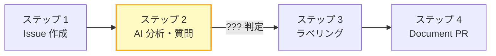
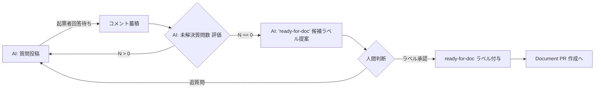

# 02. Requirement Issue が "Document 化準備完了" になる判定

**ステータス**: 確定（(d) ハイブリッドを採用、`aigile-requirement-analyzer` ワークフローに実装済み）
**関連**: [workflow.md](../workflow.md)

> **注**: 本ドキュメントは設計初期段階の議論記録です。本文中のステップ番号は議論当時のフロー定義（ラベリングを独立ステップとして配置）に基づきます。最終採用された **イベント駆動フロー** とそのステップ番号は [workflow.md](../workflow.md) を参照してください。Analyzer が `aigile:issue:requirement:ready` ラベルを付与すると Doc Writer が発火する形で (d) ハイブリッドが実装されています。

## 背景

aigile のワークフローでは、Requirement Issue が作成された後、AI が Issue を分析して不明点を Issue コメントで質問するループ（ステップ 2）があります。このループはどこかで終了し、AI が Requirement Document PR を作成するフェーズ（ステップ 4）へ進む必要があります。

この **遷移判定の基準** が未確定です。

## 論点

**Requirement Issue が「Document 化準備完了」状態に達したことを、何が判定するか？**

判定が遅すぎると Document PR が空虚な内容で作られ、判定が早すぎると AI が永遠に質問を続けてフローが進まないリスクがあります。

## 選択肢

### (a) 人間が `requirements/ready-for-doc` ラベルを付与（明示的判定）

- ステップ 3 のラベリング自体を遷移トリガにする
- リリース計画で対象 Issue を選ぶタイミングと一致するので運用とも整合
- **メリット**: 明示性、人間の最終判断
- **デメリット**: 人手介入が必須、ラベル付与忘れでフローが止まる

### (b) AI が記録する「未解決質問数」が 0 になったら自動進行

- AI が Issue body の構造化セクションに `unresolved_questions: N` を維持
- 起票者の回答により質問が解消されたら AI が N を減らす
- N = 0 になったタイミングで自動的にステップ 3/4 へ進行
- **メリット**: 完全自動化、判定の透明性
- **デメリット**: AI の解消判定が誤ると未解決のまま進行する、起票者の回答ペースに依存

### (c) 一定時間（例: 7 日）人間からの追加コメントがないタイムアウト

- 起票者・関係者からの追加情報を待つ期間を設ける
- タイムアウト後は AI が現状の情報で Document PR を作成
- **メリット**: 進行が保証される、人を急かさない
- **デメリット**: 時間的浪費、急ぎの要求が遅延

### (d) ハイブリッド: (a) または (b) のいずれかで遷移

- AI が「準備完了」と判定したら自動でラベル候補を提案、人間が承認/拒否でラベル確定
- 人間は明示的に `ready-for-doc` を付与することもできる
- **メリット**: 両方の利点を取れる、AI 判定が早すぎても人間がブロック可能
- **デメリット**: 仕様がやや複雑

## トレードオフ比較

| 選択肢 | 自動化度 | 明示性 | 失敗時の安全性 | aigile 原則との整合 |
|---|---|---|---|---|
| (a) ラベル明示 | × | ◎ | ◎ | リリース計画と一致 |
| (b) 未解決質問数 0 | ◎ | ○ | △ | 機械判定可能で aigile らしい |
| (c) タイムアウト | ○ | △ | ○ | 時間依存は aigile に異質 |
| (d) ハイブリッド | ○ | ◎ | ◎ | バランス型 |

## aigile の他の機械判定基準との整合

aigile は [escalation.md](../escalation.md) で「マージ済みか否か」という機械判定可能な明確な基準を採用しています。この一貫性で言えば、(b) の「未解決質問数 0」は同質の機械判定基準として馴染みます。

ただし Requirement 層は **不変条件として人間が承認** することが定められているため、ステップ 2 → 4 の遷移にも人間の関与を残すこと自体は不自然ではありません。

## 暫定推奨

**(d) ハイブリッド** を推奨します。

具体的なフロー:

これにより:

- AI の自律的な判定（質問数 0）でラベル候補が示される
- ただしラベル付与の最終決定は人間（Requirement 層が人間承認である不変条件と整合）
- 人間は AI の判定を待たずに直接ラベルを付与することも可能

## 判断が必要なタイミング

- `gh aw` での Requirement Issue 分析ワークフローを実装するタイミング
- Issue テンプレートを設計するタイミング（未解決質問数を本文に含めるか）

## 残課題

- 「未解決質問数」を Issue body のどこに記録するか（構造化フォーマット）
- AI が新たな質問を追加するタイミング（毎コメント解析？ 定期実行？）
- ラベル候補提案のメカニズム（コメント？ Issue 編集？）
