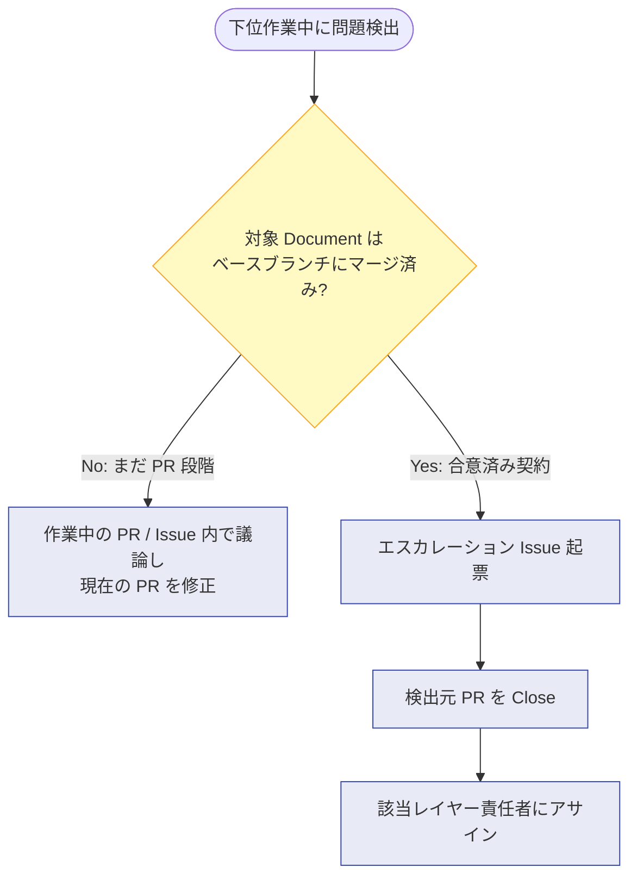
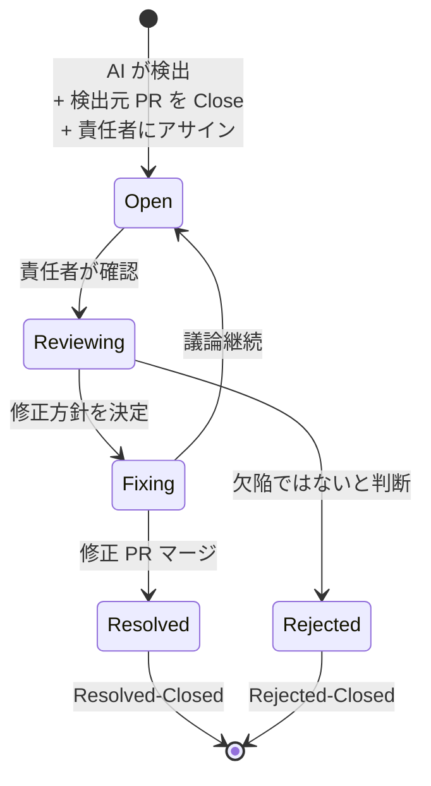
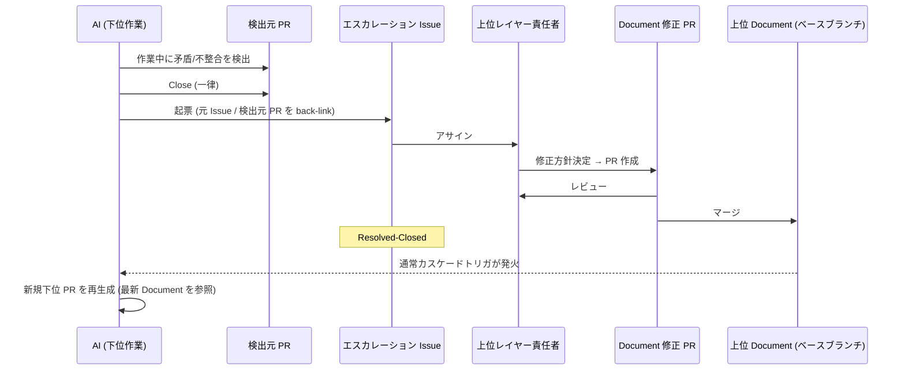

# エスカレーション機構

下位レイヤーの作業中に、既にマージ済みの上位 Document に矛盾/不整合/実現性問題が発覚した場合の処理フローを定義します。

## 基本原理: マージ済みか否かで分岐

aigile では、対象 Document が **ベースブランチ**（デフォルト `main`、[project-config.md](project-config.md) で設定可能）に **マージ済みか否か** によって対処モードが分かれます。



未マージの Document はまだ "提案" の段階なので、PR コメントでの議論で十分です。マージ済みの Document は既に "合意済みの契約" なので、契約変更の意思決定として別の箱（エスカレーション Issue）を立てて責任者にアサインします。

## 発生タイミングと対処の対応表

イベント駆動フロー（[workflow.md](workflow.md)）上で発生し得るエスカレーション事象と、その対処方針です。ステップ番号は workflow.md のトリガー・アクター表と一致します。

| # | タイミング | 検出 | 事象 | 対処 |
|---|---|---|---|---|
| α1 | Requirement Issue 分析中（ステップ 2） | AI | 新規 Issue が既存 Requirement Document と矛盾 | Requirement Issue へのコメントで指摘 |
| α2 | Requirement Doc PR 作成中（ステップ 3） | AI | Doc 内部の整合性が崩れる | その Doc PR の中で議論修正 |
| α3 | Requirement Doc PR レビュー中（ステップ 4） | 人 | 既存記述の問題に気づく | その Doc PR の中で議論修正 |
| β1 | Spec 検証・更新中（ステップ 5） | AI | マージ済み Requirement Doc が内部矛盾 | **エスカレーション Issue**（Requirement 責任者にアサイン） |
| β2 | Spec 検証・更新中（ステップ 5） | AI | マージ済み Requirement Doc が他の Requirement と矛盾 | **エスカレーション Issue**（Requirement 責任者にアサイン） |
| β3 | Spec 検証・更新中（ステップ 5） | AI | Requirement Doc が曖昧で複数の妥当な Spec が成立 | Spec PR にその旨記載し、PR レビューで議論 |
| β4 | Arch 検証・更新中（ステップ 7） | AI | 既存 Requirement / Spec が技術的に実現不可能 | **エスカレーション Issue**（実現可能な代替案を示すと議論が早い） |
| β5 | Arch 検証・更新中（ステップ 7） | AI | 既存 Architecture と新 Spec の整合が必要 | 後続 Architecture PR 内で議論（通常のカスケード作業） |
| γ1 | 実装計画立案中（ステップ 9、将来予定） | AI | 既存実装が Architecture に追いついていない | **対処不要**。Document → 実装の流れで一時的に生じる正常状態 |
| γ2 | 実装中（ステップ 10、将来予定） | AI | Spec の曖昧さが実装時に顕在化 | **エスカレーション Issue**（Spec 責任者） |
| γ3 | 実装中（ステップ 10、将来予定） | AI | Architecture が現コードベースの制約と非互換 | **エスカレーション Issue**（Architecture 責任者） |

`γ1` は aigile の SoT モデル上、**Document が実装に先行している状態は正常** と定義します。Doc → 実装の方向の "乖離" は一時状態であり、エスカレーション対象ではありません。

## エスカレーション Issue の仕様

### 必須フィールド

| フィールド | 説明 |
|---|---|
| 対象 Document | 問題のある Document のパスと該当箇所 |
| 検出元 PR | このエスカレーションを引き起こした PR への back-link（必ず存在） |
| 元 Requirement Issue | 検出元 PR が辿る起点 Requirement Issue への back-link |
| 種別 | Inconsistency / Infeasibility / Ambiguity のいずれか |
| Assignee | 対象 Document のレイヤーの責任者（`.aigile/stakeholders.yml` から解決） |

### 任意フィールド

| フィールド | 説明 |
|---|---|
| 代替案 | AI が実現可能な代替案を提示できる場合は記載（β4 などで特に有用） |

代替案は **必須ではありません**。エスカレーション Issue の主目的は議論の起点を作ることであり、解決策の検討は責任者の役割です。

### ライフサイクル



## 検出元 PR の扱い

エスカレーション Issue が立った瞬間、**検出元 PR は一律 Close** されます。

### なぜ「待機」ではなく「Close」か

| 観点 | Close 方式（採用） | 待機方式 |
|---|---|---|
| 状態機械 | Open / Close の二値で済む | Open / Blocked / Resumed など複数状態が必要 |
| ブランチ管理 | 一旦廃棄、再生成 | 長期間オープンで陳腐化リスク |
| 上位修正後の整合 | 最新 Document を参照して新規作成 | 古いブランチを rebase / 修正する必要 |
| 監査 | Closed PR として永続的に残る | 同じ |

aigile では **「下位作業の中間生成物は使い捨て可能」を不変条件** として置いているため（[concepts.md](concepts.md) 参照）、Close-and-Recreate がコスト見合います。これは AI ネイティブだからこそ成り立つ設計です。

## 修正後の再起動: 通常フローのトリガを再利用

上位 Document の修正 PR がマージされると、aigile の **通常のカスケード作業トリガ** がそのまま発火します:

- Requirement Document マージ → AI が Specification / Architecture PR を作成
- Architecture Document マージ → AI が実装計画 / 実装 Issue を起票

エスカレーション専用のトリガは不要です。エスカレーション Issue は「責任者にアサインする箱」としての役割に純化され、トリガの責務を持ちません。

### "どの Requirement Issue の作業を再開するか" の解決

エスカレーション Issue 内に元 Requirement Issue / 元 PR への back-link を必須にすることで、上位修正後の再起動時に「どの Requirement Issue を起点に下位作業を再生成すべきか」が辿れます。

### 検出から再起動までの全体シーケンス



## エスカレーション Issue の例

```markdown
Title: [escalation] Requirement Document "auth.md" に内部矛盾

## 概要
種別: Inconsistency (β1)
対象 Document: .aigile/docs/L1_requirements/auth.md (Section 3.2 ~ 3.4)
検出元 PR: #142 (Spec PR for Authentication, Closed)
元 Requirement Issue: #98

## 検出された矛盾
Section 3.2 では "SSO は Google のみサポート" と記述されているが、
Section 3.4 では "全ての主要プロバイダをサポート" と記述されている。
両者は矛盾する。

## 代替案（任意）
- (a) 3.2 を採用し、3.4 を "Google のみ" に修正
- (b) 3.4 を採用し、3.2 を削除して全プロバイダ対応に統一

## Assignee
@product (Requirement 責任者)
```
