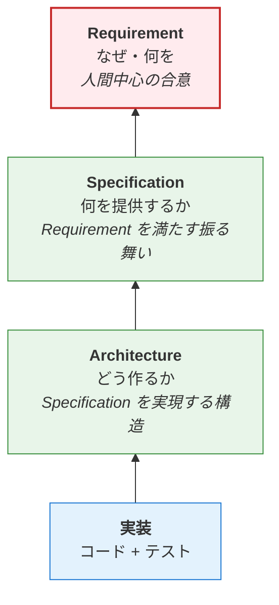

# Document レイヤーモデル

aigile では Document を 3 つのレイヤーに分割し、各レイヤーに固有の責任者と承認者、および物理ディレクトリを割り当てます。レイヤー間の依存関係は frontmatter で機械可読に宣言します（[document-model.md](document-model.md) 参照）。

## 3 レイヤー構成

| レイヤー | 役割 | 質問 | 変更頻度 | 物理配置 |
|---|---|---|---|---|
| **Requirement** | 満たすべき要求 | "誰が、何を、なぜ望むか" | 中（ビジネス起点） | `.aigile/docs/L1_requirements/<slug>.md` |
| **Specification** | 提供する機能の振る舞い | "我々は何を提供するか" | 中（要件起点） | `.aigile/docs/L2_specifications/<slug>.md` |
| **Architecture** | 構造・技術選定・契約 | "どう作るか" | 低（基盤） | `.aigile/docs/L3_architectures/<slug>.md` |

「詳細設計」レイヤーは設けません。実装に近接する詳細はコード + テスト + ADR で記述し、別レイヤーとして文書化すると二重保守を招くという判断です。

## レイヤー間の依存関係

矢印は **依存方向** を表します。下位レイヤー（実装/Architecture/Specification）は上位レイヤー（Architecture/Specification/Requirement）を満たすために存在するので、下位から上位へ依存します。frontmatter 上は `depends_on` を **下位 → 上位の単方向** でのみ書き、上位の Document には下位への参照を書かないことで二重保守を避けます（詳細: [document-model.md](document-model.md)）。

赤枠の Requirement は **承認者が人間に限定** される不変条件レイヤーです。下位作業中に上位の矛盾/欠陥が発覚した場合は [escalation.md](escalation.md) のフローで処理します。

## Spec Kit との対応関係

[GitHub Spec Kit](https://github.com/github/spec-kit) のアーティファクトを aigile のレイヤーにマッピングできます:

| aigile レイヤー | Spec Kit 相当 | 備考 |
|---|---|---|
| Requirement | `spec.md` の "what + why" 部分 | Spec Kit は spec.md に統合しているが、aigile では Issue → Requirement Document に分離 |
| Specification | `spec.md` の詳細部 + `contracts/` の振る舞い側 | "我々が何を提供するか" |
| Architecture | `plan.md` + `data-model.md` + `contracts/` の構造側 + `research.md` | "どう作るか" |

aigile が Spec Kit の `/speckit.*` コマンド資産を流用する場合、上記マッピングに従って各 Document を生成できます。

## なぜ Requirement と Specification を分けるか

Spec Kit は両者を `spec.md` に統合していますが、aigile では分離します:

- **Requirement = 追加要求の受け入れ済み記録**: ステークホルダーが何を望むか（What stakeholders want）
- **Specification = 提供する振る舞いの定義**: 我々が何を提供するか（What we deliver）

両者は通常 1:1 に近いものの、

- 1 つの Requirement が複数の Specification に分解されること
- 複数の Requirement が共通の Specification にまとめられること
- Requirement は満たすが Specification は別経路で実現されること

があり得ます。Issue（追加の要求）→ Requirement Document（受け入れ済み要求）→ Specification Document（提供振る舞い）と段階的に "外部からの要求" を "内部の提供契約" に変換していくのが aigile の中核です。

## レイヤーの責任者

各レイヤーに承認者（責任者）が定義されます。詳細は [stakeholders.md](stakeholders.md) を参照。

| レイヤー | 承認者の型 | 制約 |
|---|---|---|
| Requirement | **人間に限定**（不変条件） | AI 単独承認は構造的に不可能 |
| Specification | 人間 または AI（プロジェクトで選択可） | - |
| Architecture | 人間 または AI（プロジェクトで選択可） | - |
