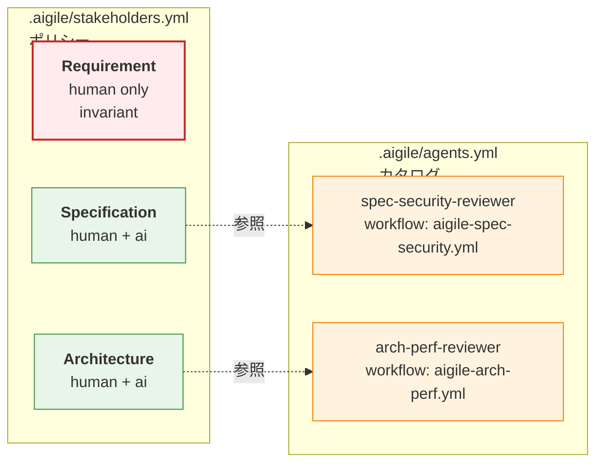

# 承認モデル / ステークホルダー宣言

aigile では、各 Document レイヤーの承認に関わる主体（人間 / AI エージェント）をリポジトリごとに宣言します。多視点レビューや AI 承認も同じ構造で表現できます。

## 設定ファイルの分離

責任の所在と実装手段を分離するため、2 つの設定ファイルに分けて宣言します。

| ファイル | 役割 | 内容 |
|---|---|---|
| `.aigile/agents.yml` | エージェントカタログ | 利用可能な AI エージェントの実装参照（workflow ファイル、モデル等） |
| `.aigile/stakeholders.yml` | 承認ポリシー | レイヤーごとの承認者一覧 |

なお、リポジトリ全体に関わる設定（ベースブランチ名等）は別途 `.aigile/config.yml` で管理します。[project-config.md](project-config.md) を参照してください。

分離の利点:

1. **エージェントの再利用性** — 同一エージェントを複数レイヤーで参照可能
2. **多視点 AI 承認** — セキュリティ観点、性能観点など独立した AI レビュアーを並列に設置可能
3. **疎結合** — エージェントの中身（プロンプト、参照ドキュメント）が進化してもポリシーは変えなくて良い



## `.aigile/agents.yml` の構造

プロジェクトで使用するカスタム AI エージェントを宣言します。

```yaml
agents:
  spec-security-reviewer:
    workflow: .github/workflows/aigile-spec-security.yml
    description: "Spec のセキュリティ/プライバシ観点レビュー"
    model_hint: claude-opus-4-7

  arch-perf-reviewer:
    workflow: .github/workflows/aigile-arch-perf.yml
    description: "Architecture の性能観点レビュー"
```

各エージェントは [GitHub Agentic Workflow](https://docs.github.com/) (`gh aw`) として実装されることを想定しています。

## `.aigile/stakeholders.yml` の構造

レイヤーごとの承認に関わる主体を宣言します。

```yaml
layers:
  requirement:
    approver_type: human          # invariant — override 不可
    approvers:
      - "@product"

  specification:
    approver_type: human_or_ai
    approvers:
      humans: ["@tech-leads"]
      ai_agents: ["spec-security-reviewer"]   # agents.yml の名前で参照

  architecture:
    approver_type: human_or_ai
    approvers:
      humans: ["@architects"]
      ai_agents: ["arch-perf-reviewer"]
```

### フィールド定義

| フィールド | 型 | 説明 |
|---|---|---|
| `approver_type` | `human` / `ai` / `human_or_ai` | `approvers` に列挙できる主体の型。Requirement は **`human` 固定**（不変条件） |
| `approvers` | リスト or オブジェクト | このレイヤーで承認に関わる主体。`approver_type` が `human_or_ai` の場合は `humans` / `ai_agents` に分けて指定 |

`approvers` は **「このレイヤーの承認権限を持つ主体の集合」** を意味します。マージに必要な承認の数や組み合わせは aigile 側では強制しません（後述のマージゲート参照）。多視点レビューが必要なら、その観点を担う人物 / エージェントを `approvers` に追加します。

## マージゲートの扱い

`approvers` の宣言と「PR マージを許可する基準」は **別の関心事** です。aigile では段階的に enforce を強めていく方針です。

| フェーズ | 機構 | 現状 |
|---|---|---|
| **G4: 運用ルール** | `approvers` は文書化された宣言。マージ判定は人間 / レビュアーの判断に委ねる | **現在ここ** |
| **G1: 専用 Status Check (将来)** | aigile が配布する `aigile-merge-gate` ワークフローが PR ラベルからレイヤーを判定し、`approvers` の review 状態を集計して required check を返す | 未実装 |

G4 で運用する間は、ブランチプロテクションで「PR レビュー 1 件以上」など GitHub 標準の最低限ガードを併用することを推奨します。aigile としての厳密な承認集計は G1 で導入します。

## 不変条件: Requirement = 人間承認

Requirement レイヤーの `approver_type` は **`human` で固定** されます。設定ファイル上で `ai` や `human_or_ai` を指定しても、aigile ツール側で無効化されます。

理由:

- AI による自律実装を許す以上、外部からの "追加要求" の受け入れ判断には必ず人間の責任が残る必要がある
- 設定ミスや悪意ある変更でこの不変条件を突破できないよう、構造的にロックする

## AI 承認の監査痕跡

AI エージェントが承認者になる場合、**監査可能性** を保つため、AI が投稿する PR Review 本文には構造化メタデータを必須にします。

```yaml
aigile:
  approval:
    layer: specification
    agent: spec-security-reviewer
    model: claude-opus-4-7
    referenced_docs:
      - requirement/auth.md@abc1234
    prompt_hash: 7f3a...
    timestamp: 2026-05-15T12:34:56Z
```

これにより、過去の AI 承認を「どのモデルが、どのコンテキストで、どの Document の版を参照して承認したか」のレベルで再現できます。

## 想定する運用シナリオ

### シナリオ A: 小規模プロジェクト（全て人間レビュー）

```yaml
layers:
  requirement:   { approver_type: human, approvers: ["@me"] }
  specification: { approver_type: human, approvers: ["@me"] }
  architecture:  { approver_type: human, approvers: ["@me"] }
```

### シナリオ B: AI 主導（Requirement のみ人間）

```yaml
layers:
  requirement:
    approver_type: human
    approvers: ["@product"]
  specification:
    approver_type: ai
    approvers:
      ai_agents: ["spec-reviewer"]
  architecture:
    approver_type: ai
    approvers:
      ai_agents: ["arch-reviewer"]
```

### シナリオ C: 多視点 AI レビュー + 人間最終承認

```yaml
layers:
  specification:
    approver_type: human_or_ai
    approvers:
      humans: ["@tech-leads"]
      ai_agents: ["spec-security-reviewer", "spec-perf-reviewer"]
```
