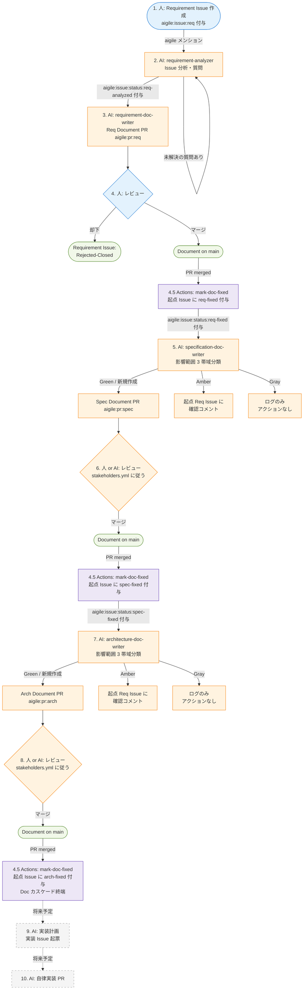

# 開発ワークフロー

aigile が提案するトレーサビリティ重視の開発フローを定義します。Document = Source of Truth の原則（[concepts.md](concepts.md) 参照）と、依存関係を frontmatter で機械可読に宣言する規約（[document-model.md](document-model.md) 参照）に基づき、Issue から実装までを一貫した連鎖で繋ぎます。

本フローは **イベント駆動** です。「次の順番だから次のステップに進む」のではなく、**特定のイベント（Issue 作成、PR マージ、ラベル付与など）が次のワークフローを発火させる** 形で進みます。下位レイヤーは、上位 Document の変更を検知して自律的に再評価する仕組みになっています。

## トリガー・アクター対応表

| # | イベント | トリガー条件 | アクター | 出力 | ワークフロー |
|---|---|---|---|---|---|
| 1 | 要求の起票 | 人間が `Requirement Issue (追加の要求)` テンプレートで Issue を作成 | 人間 | `aigile:issue:req` ラベル付き Issue | (Issue テンプレート) |
| 2 | 要求の分析 | 対象 Issue のコメントで `aigile` をメンション | AI | Issue コメント（質問 or Ready 判定通知）／ `aigile:issue:status:req-analyzed` ラベル付与 | [aigile-requirement-analyzer](../.github/workflows/aigile-requirement-analyzer.md) |
| 3 | Document 化 | `aigile:issue:status:req-analyzed` ラベル付与 | AI | `aigile:pr:req` ラベル付き PR（`.aigile/docs/L1_requirements/<slug>.md`） | [aigile-requirement-doc-writer](../.github/workflows/aigile-requirement-doc-writer.md) |
| 4 | Requirement 承認 | 人間が PR をレビューしマージ | 人間 | Document on main | (GitHub 標準 PR フロー) |
| 4.5 | 進行ラベル付与 | `aigile:pr:*` ラベル付き PR の merged | 自動（Actions） | 起点 Requirement Issue に `aigile:issue:status:{req,spec,arch}-fixed` を付与 | [aigile-mark-doc-fixed](../.github/workflows/aigile-mark-doc-fixed.yml) |
| 5 | Spec 検証・更新 | 起点 Issue への `aigile:issue:status:req-fixed` 付与 | AI | Green: `aigile:pr:spec` 付き PR ／ Amber: 起点 Requirement Issue にコメント ／ Gray: ログのみ | [aigile-specification-doc-writer](../.github/workflows/aigile-specification-doc-writer.md) |
| 6 | Specification 承認 | 人間 or AI が PR をレビューしマージ | `.aigile/stakeholders.yml` の設定に従う | Document on main（マージで 4.5 が再度起動し `spec-fixed` を付与） | (PR フロー) |
| 7 | Arch 検証・更新 | 起点 Issue への `aigile:issue:status:spec-fixed` 付与 | AI | Green: `aigile:pr:arch` 付き PR ／ Amber: 起点 Requirement Issue にコメント ／ Gray: ログのみ | [aigile-architecture-doc-writer](../.github/workflows/aigile-architecture-doc-writer.md) |
| 8 | Architecture 承認 | 人間 or AI が PR をレビューしマージ | `.aigile/stakeholders.yml` の設定に従う | Document on main（マージで 4.5 が再度起動し `arch-fixed` を付与。Doc カスケードはここで終端） | (PR フロー) |
| 9 | 実装計画 | （未実装、将来予定） | AI | 実装 Issue | (未定義) |
| 10 | 実装自律 PR | （未実装、将来予定） | AI | 実装 PR | (未定義) |

凡例:
- 列「アクター」: そのイベントを **進める主体**。人間アクションは GitHub UI 操作、AI アクションは `gh aw` ワークフローで自動実行される。「自動（Actions）」は通常の GitHub Actions ワークフローによる自動実行。
- 列「ワークフロー」: 該当する gh-aw ワークフロー定義ファイル。`(...)` で括ったものは GitHub 標準機能で対応。
- ステップ 4.5 (`aigile-mark-doc-fixed`) は Doc PR マージごとに毎回走り、レイヤーごとに対応する `aigile:issue:status:*-fixed` を起点 Requirement Issue に付与するブリッジ。下位レイヤーワークフローはこのラベル付与イベントで自律的に起動する。
- 起点 Requirement Issue は **実装フェーズ完了まで open のまま保持** する（旧来は Req Doc マージで自動 Close していたが、ステータスラベルで進行を表現する方針に変更）。

## カスケード図

凡例:
- 青系: 人間アクション
- オレンジ系: AI アクション (`gh aw`)
- 紫系: 通常 GitHub Actions（`aigile-mark-doc-fixed` ブリッジ）
- 緑系: 終端状態（Document が main にマージされた状態）
- 灰色破線: 将来予定（未実装）

## 影響範囲の 3 帯域（Spec / Arch 検証時）

ステップ 5 / 7 の Spec/Arch 検証では、上位レイヤー Document の変更が下位 Document に与える影響を以下の 3 帯域で分類します（詳細は [document-model.md](document-model.md) 参照）:

| 帯域 | 判定 | アクション |
|---|---|---|
| **Green** | 既存 Document と明確に矛盾、または依存先の中核フィールドが変更されている。新規依存（既存 Doc 不在）も Green として扱う | 自動で下位 Document の更新 / 新規作成 PR を発行 |
| **Amber** | 関連はあるが矛盾の判定が曖昧、人間判断が必要 | 起点 Requirement Issue にコメントで通知 |
| **Gray** | 依存先が動いたが下位 Document の内容変更は不要 | ログ出力のみ |

すべての PR / コメントは **起点 Requirement Issue 番号を本文中に明記** します。新トリガー方式では起点 Requirement Issue 番号が GitHub Issue イベントで直接渡されるため、Spec / Arch ワークフローは `${{ github.event.issue.number }}` をそのまま利用します（旧 PR 起点時代の `depends_on` 経由の `source_issue` 解決は不要）。`aigile-mark-doc-fixed` がマージされた PR の本文から「Requirement Issue #N」表記を正規表現で抽出し、対応する Issue に次レイヤーの `*-fixed` ラベルを付与します。

## レイヤー構造との対応

各イベントは [layers.md](layers.md) で定義した 3 レイヤーに対応します:

| イベント # | レイヤー |
|---|---|
| 1-4 | Requirement |
| 5-6 | Specification |
| 7-8 | Architecture |
| 9-10 | (将来予定、Architecture の下位として実装) |

## 失敗経路: エスカレーション

ステップ 5 以降で、上位レイヤー Document に矛盾・不整合・実現性問題が発覚した場合、通常フローを中断して **エスカレーション** に分岐します。詳細は [escalation.md](escalation.md) を参照。

要点:
- 検出元 PR を Close
- エスカレーション Issue を新規起票（種別: Inconsistency / Infeasibility / Conflict）
- 対象 Document の責任レイヤーの承認者にアサイン
- 上位 Document の修正 PR がマージされたら、下位はカスケードで再生成される

## 設定でカスタマイズ可能な箇所

| ステップ | カスタマイズ要素 | 設定箇所 |
|---|---|---|
| 6, 8 | レビューの主体（AI / 人 / 両方） | `.aigile/stakeholders.yml` |
| 6, 8 | 承認に必要な票数 | `.aigile/stakeholders.yml` |
| 5, 7 | 利用するカスタム AI エージェント | `.aigile/agents.yml` |
| 全体 | ベースブランチ（Source of Truth として扱うブランチ） | `.aigile/config.yml` |

設定の詳細は [stakeholders.md](stakeholders.md) および [project-config.md](project-config.md) を参照。

## なぜ「ステップ番号」ではなく「イベント駆動」か

aigile は AI が自律的に開発を進めることを前提にしているため、人間が「次は何番のステップだ」と把握して進める必要がない設計を目指しています。各ワークフローは **入力イベント** が発生したら自律的に起動し、適切な出力イベント（PR / コメント / ラベル）を生成します。

人間の責務は、

- 起点となる Requirement Issue を起票する
- AI が提示した PR / コメントをレビュー・承認する
- AI が判断できなかった Amber 案件に判断を返す

の 3 点に集約されます。残りはイベントのカスケードで自律的に進みます。
