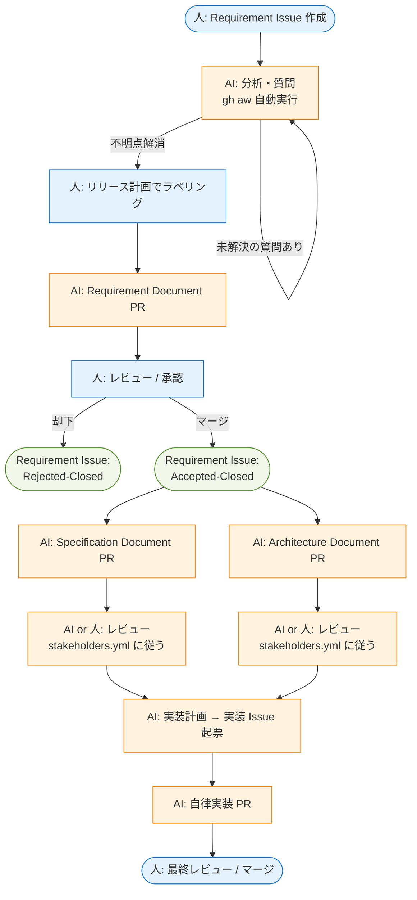

# 開発ワークフロー

aigile が提案するトレーサビリティ重視の開発フローを定義します。Document = Source of Truth の原則（[concepts.md](concepts.md) 参照）に基づき、Issue から実装までを一貫した連鎖で繋ぎます。

## 10 ステップフロー

| # | アクター | アクション | 成果物 |
|---|---|---|---|
| 1 | 人間 | Requirement Issue を作成 | Issue（追加の要求） |
| 2 | AI | Requirement Issue を分析し、不明点を Issue コメントで質問（`gh aw` による自動実行） | コメントスレッド |
| 3 | 人間 | リリース計画にて、次リリース対象の Requirement Issue をラベリング | ラベル付与 |
| 4 | AI | Requirement Document の作成・更新 PR を発行 | Document PR |
| 5 | 人間 | Requirement Document PR をレビュー | レビュー / 承認 |
| 6 | (自動) | Requirement Document PR がマージされたら、対象 Requirement Issue を Accepted-Closed | Issue 完遂 |
| 7 | AI | Requirement Document を満たす Specification Document および Architecture Document を作成・更新する PR を発行 | Document PR |
| 8 | AI または人間 | Specification / Architecture Document PR をレビュー（[stakeholders.md](stakeholders.md) の設定に従う） | レビュー / 承認 |
| 9 | AI | 既存実装と Document の情報をもとに、実装計画を立て、実装 Issue を起票 | 実装 Issue |
| 10 | AI | 実装 Issue に従い、自律的に実装し PR を発行 | 実装 PR |

## 全体フロー図

凡例:
- 青系: 人間アクション
- オレンジ系: AI アクション
- 緑系: 終端状態

## レイヤー構造との対応

10 ステップは、4 つの Document レイヤー（[layers.md](layers.md) 参照）に対応します:

| ステップ | レイヤー |
|---|---|
| 1-6 | Requirement |
| 7（Spec 部分）, 8 | Specification |
| 7（Arch 部分）, 8 | Architecture |
| 9-10 | (Details または実装) |

## 失敗経路: エスカレーション

ステップ 7 以降で、上位レイヤーの Document に矛盾/不整合/実現性問題が発覚した場合、通常フローを中断して **エスカレーション** に分岐します。詳細は [escalation.md](escalation.md) を参照。

## 設定でカスタマイズ可能な箇所

| ステップ | カスタマイズ要素 | 設定箇所 |
|---|---|---|
| 5, 8 | レビューの主体（AI / 人 / 両方） | `.aigile/stakeholders.yml` |
| 8 | 承認に必要な票数 | `.aigile/stakeholders.yml` |
| 7, 9, 10 | 使用するカスタムエージェント | `.aigile/agents.yml` |

設定の詳細は [stakeholders.md](stakeholders.md) を参照。
